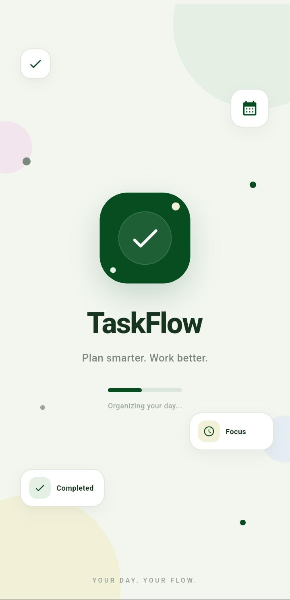
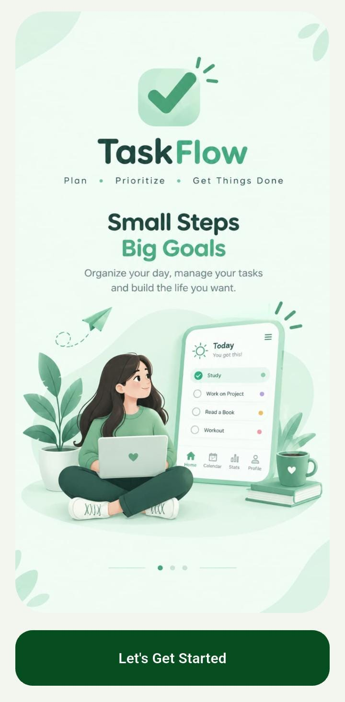
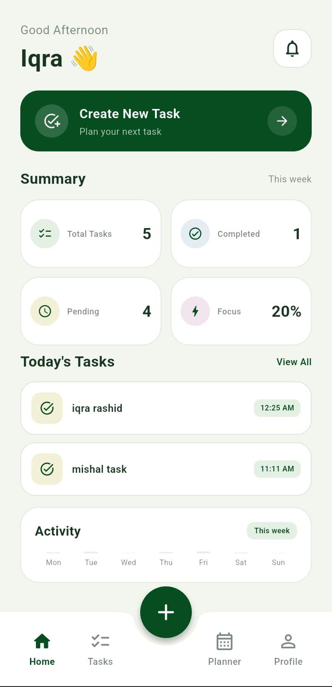
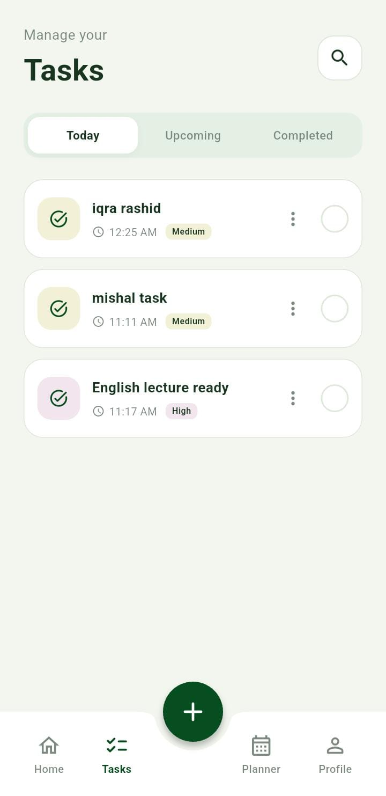
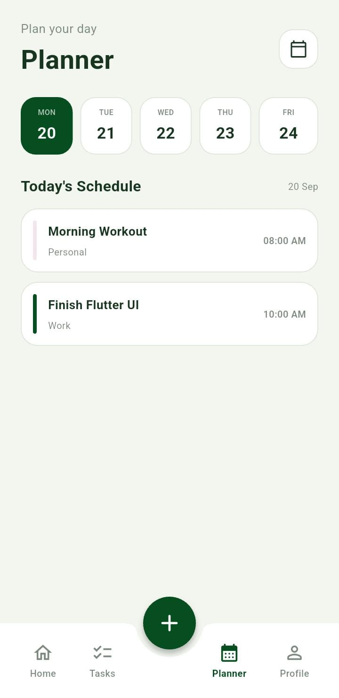
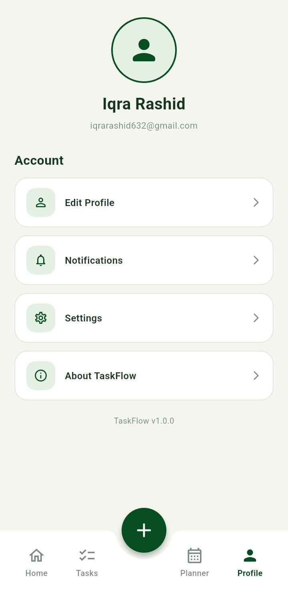

# TaskFlow 📋

A modern and clean **Flutter Task Management App** designed to help users organize daily tasks, manage schedules, track productivity, and maintain a simple workflow.

TaskFlow focuses on a minimal, modern UI with a soft pastel design and practical task-management functionality.

---

## ✨ Features

* 🏠 Modern Home Dashboard
* ➕ Add New Tasks
* ✏️ Edit Existing Tasks
* 🗑️ Delete Tasks
* ✅ Complete / Uncomplete Tasks
* 🔎 Task Search
* 📅 Daily Planner
* 📊 Productivity Overview
* 👤 Editable User Profile
* 🔔 Notification Preference
* 💾 Local Data Persistence
* 🎨 Responsive Modern UI
* 🧩 Modular Flutter Architecture

---

## 📱 Screens

### Splash Screen

Modern animated splash screen introducing the TaskFlow experience.

### Welcome Screen

Clean onboarding screen with a simple call-to-action to enter the application.

### Home Dashboard

Provides a quick overview of:

* Total Tasks
* Completed Tasks
* Pending Tasks
* Productivity / Focus
* Recent Tasks
* Weekly Activity

### Tasks

Users can:

* View today's tasks
* View upcoming tasks
* View completed tasks
* Search tasks
* Edit tasks
* Delete tasks
* Mark tasks as completed

### Planner

A dedicated daily schedule where tasks can be viewed according to their selected date.

### Profile

Users can update:

* Name
* Email
* Notification preference

## 📸 App Screenshots

### Splash Screen


### Welcome Screen


### Home Dashboard


### Tasks


### Planner


### Profile


## 🛠️ Tech Stack

* **Flutter**
* **Dart**
* **Material Design**
* **SharedPreferences**
* Local JSON-based data persistence
* Modular widget-based architecture

---

## 🏗️ Project Structure

```text
lib/
│
├── data/
│   ├── planner_data.dart
│   └── task_data.dart
│
├── models/
│
├── screens/
│   ├── splash_screen.dart
│   ├── welcome_screen.dart
│   ├── main_screen.dart
│   ├── home_screen.dart
│   ├── tasks_screen.dart
│   ├── planner_screen.dart
│   └── profile_screen.dart
│
├── services/
│   └── task_storage.dart
│
├── theme/
│   └── app_theme.dart
│
├── widgets/
│   ├── add_task_sheet.dart
│   ├── bottom_nav_bar.dart
│   ├── summary_card.dart
│   ├── task_card.dart
│   ├── planner_date_selector.dart
│   ├── planner_task_card.dart
│   ├── profile_header.dart
│   └── profile_menu_item.dart
│
└── main.dart
```

---

## 💾 Data Persistence

TaskFlow uses **SharedPreferences** for local data persistence.

The following information is stored locally:

* Tasks
* Planner tasks
* Profile name
* Profile email
* Notification preference

This allows task and profile data to remain available after restarting the application.

---

## 🎨 Design

TaskFlow uses a soft pastel visual system focused on:

* Mint green
* White
* Soft yellow
* Soft pink
* Soft blue
* Dark green typography

The interface was designed with a focus on:

* Clean spacing
* Rounded cards
* Simple navigation
* Consistent typography
* Mobile-friendly layouts
* Minimal visual clutter

---

## 📅 Planner Note

The current Planner implementation uses a predefined set of dates for demonstration purposes.

Dynamic calendar/date generation can be added in a future version.

---

## 🚀 Getting Started

### 1. Clone the repository

```bash
git clone YOUR_REPOSITORY_URL
```

### 2. Open the project

```bash
cd taskflow
```

### 3. Install dependencies

```bash
flutter pub get
```

### 4. Run the application

```bash
flutter run
```

---

## 📦 Build APK

To generate a release APK:

```bash
flutter build apk --release
```

The generated APK can be found inside:

```text
build/app/outputs/flutter-apk/release/
```

---

## 🔮 Future Improvements

Possible future enhancements include:

* Dynamic calendar
* Firebase authentication
* Cloud task synchronization
* Push notifications
* Task categories
* Recurring tasks
* Dark mode
* Advanced productivity analytics
* Cloud backup

---

## 👨‍💻 Developer

**Iqra Rashid**

Flutter / Dart Developer

---

## 📄 License

This project was created for learning, portfolio, and demonstration purposes.
